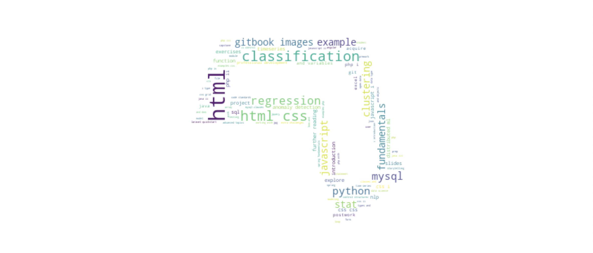
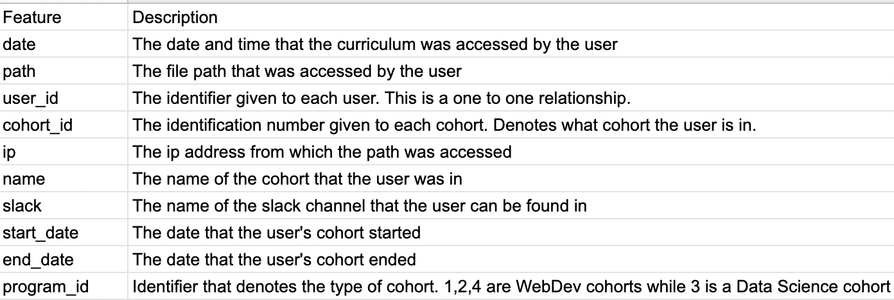

# CodeUp Curriculum Logs Anomaly Detection 

## Project Overview: 
- Working with a team, explore the CodeUp curriculum logs in order to provide responses to at least five of the following questions: 
  1. Which lesson appears to attract the most traffic consistently across cohorts (per program)?
  2. Is there a cohort that referred to a lesson significantly more than other cohorts seemed to gloss over?
  3. Are there students who, when active, hardly access the curriculum? If so, what information do you have about these students?
  4. Is there any suspicious activity, such as users/machines/etc accessing the curriculum who shouldn’t be? Does it appear that any web-scraping is happening? Are there any suspicious IP addresses?
  5. At some point in 2019, the ability for students and alumni to access both curriculums (web dev to ds, ds to web dev) should have been shut off. Do you see any evidence of that happening? Did it happen before?
  6. What topics are grads continuing to reference after graduation and into their jobs (for each program)?
  7. Which lessons are least accessed?
  8. Anything else I should be aware of?

## Executive Summary:
- It seems as if two cohorts were not properly assigned names. This largely accounts for the missing data. 
  - Missing cohort identifiers likely account for most unexplained anomalies.
- The most accessed lessons are as follows:
  - For WebDev: Working with data types, operators, and variables
  - For Data Science: Classification Overview
- The Marco cohort has the most searches of the most accessed javascript lesson.
  - In terms of traffic, top five cohorts make up 26% of traffic to that lesson, while the bottom five makes up 0.2% of traffic.
- For the Web Development program Java lessons account for 21.5%, Javascript lessons account for 20.6%, and Spring lessons account for 13.3% of all content accessed by WebDev grads after graduation. Of note, the top four most accessed lessons were all covering Spring.
- For the Data Science program SQL lessons account for 16.2%, Fundamentals lessons account for 15.8%, and Classification lessons account for 13.7% of all content accessed by DS grads after graduation.
- 450 of the 2300 (~20%) pages have been accessed only once.

## Business Goals:
- Provide responses to at least 5 of the questions above to the supervisor in a timely fashion. 
- Provide a single slide that can be incorporated into an existing presentation. 
- Follow up with an email giving more in depth answers to the above questions.

## Project Goals: 
- Explore the questions asked above to give insightful responses.
- Ask questions during the exploration phase to better understand what material is being accessed, how it is being accessed, what material is the most/least referred to, and if there is any anomalous activity. 
- Explore apparent anomalous activity to either explain it or offer recommendations on how to combat it. 

## Deliverables:
- Answers to at least 5 of 7 questions related to accessing the website.
- 1 Slide summarization of our findings.
- 1 email from Team Leader to codeup data science email.
- 1 final notebook of our research process and findings.

## Data Dictionary

## Project Plan
- Acquire the data from the Codeup Database and store the function in the wrangle.py file. 
- Have each team member clean the data in a way that best fits their needs for data exploration. 
- Explore the data and ask questions to clarify what is actually happening.
  - Ensure to properly annotate, comment, and use markdowns.
  - Store functions used in a wrangle.py file for reproducability. 
  - Visualize the data when applicable. 
- Deliver answers to supervisor and datascience@codeup.com

## Reproduce this Project
 - In order to reproduce this project, you will need: 
  - env.py file with credentials that will give you access to the CodeUp database
  - Ability to clone this repository to local environment.
  - Ability to run notebook.
